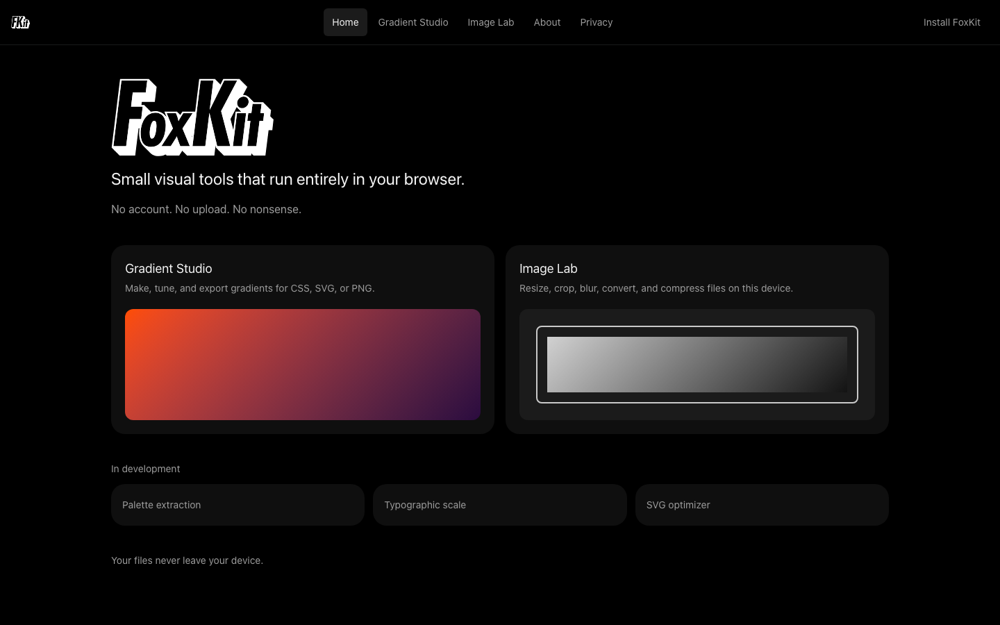

# FoxKit

Small visual tools that run entirely in your browser.

No account. No upload. No nonsense. Your files never leave your device.



## Tools

- **Gradient Studio** — linear, radial, conic, and freeform gradients with CSS, SVG, and PNG export, local saves, and shareable URLs.
- **Image Lab** — resize, crop, blur, convert, and compress images locally in a Web Worker.
- **Palette** — extract colors from a local image, drag sample points, save palettes, and copy HEX or CSS.

## Develop

```bash
npm install
npm run dev
```

Open `http://localhost:5173/foxkit/`.

```bash
npm test
npm run build
npm run preview
```

## Architecture

FoxKit is a static Vite + React + TypeScript PWA. There is no backend, no environment variables, and no API keys.

- Tool state lives in Zustand.
- Saved gradients, palettes, and recent image settings live in IndexedDB via Dexie.
- Image work runs in `src/workers/image.worker.ts` with `OffscreenCanvas` when available.
- CSS gradients render through CSS and Canvas. Freeform gradients render through Canvas and export as SVG or PNG only.
- Share links encode gradient state in the query string.

## Privacy

Processing happens in your browser. Files are not uploaded. Clearing site data removes local saves.

## Deploy

Pushes to `main` publish to GitHub Pages:

[https://ethanfox.github.io/foxkit/](https://ethanfox.github.io/foxkit/)

## License

MIT
